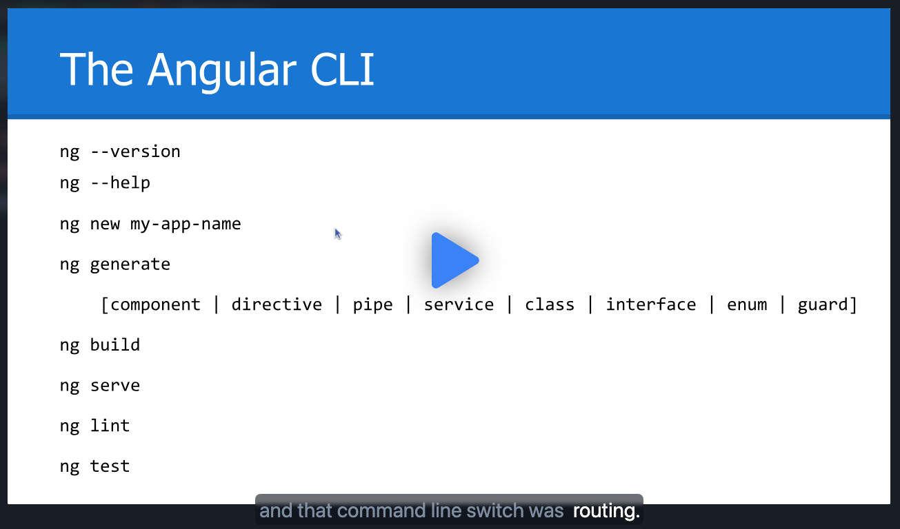

# scrimba-dev

build-your-first-angular-app




The Angular CLI

```


ng --version
ng --help

ng new my-app-name

ng generate
    [component | directive | pipe | service | class | interface | enum | guard]

ng build
ng serve
ng lint
ng test

```
and that command line switch was routing.
Explanation:
ng new my-app-name: Creates a new Angular project with the specified name.
--routing: This flag tells the Angular CLI to include the Angular Router and set up routing during project creation.
This will:

Install the @angular/router package (if not already installed).
Create an initial app-routing.module.ts file with a basic routing setup.
Import the AppRoutingModule into your main AppModule.
```
ng new my-app-name --routing
```
If you want to generate a routing module separately later (e.g., when generating a feature module), you can use:
ng generate module app-routing --module=app --flat
